# Create models with OML Notebooks and OML AutoML UI

In this chapter, we will connect to OML Notebooks and split the data into training and test chunks. We will use the train data to run the OML AutoML UI and create a model to make our prediction. In the succeeding chapters, we will deploy the model for use with OML Services REST endpoints.

Estimated Time: 15 minutes

### Objectives

* Use OML AutoML UI to create the models
* See the models created and Deploy one

### Prerequisites
* Autonomous Database created
* OML user created
* Data loaded in the database


##                                           

## Task 1: Connect to OML Notebooks and display Insurance Customer Data

* In the Autonomous Database instance details page. Click on the Database Actions button.
  

* Click **View all database actions**.
  

* The Database Actions launchpad page is now open and connected by default with the ADMIN user.
  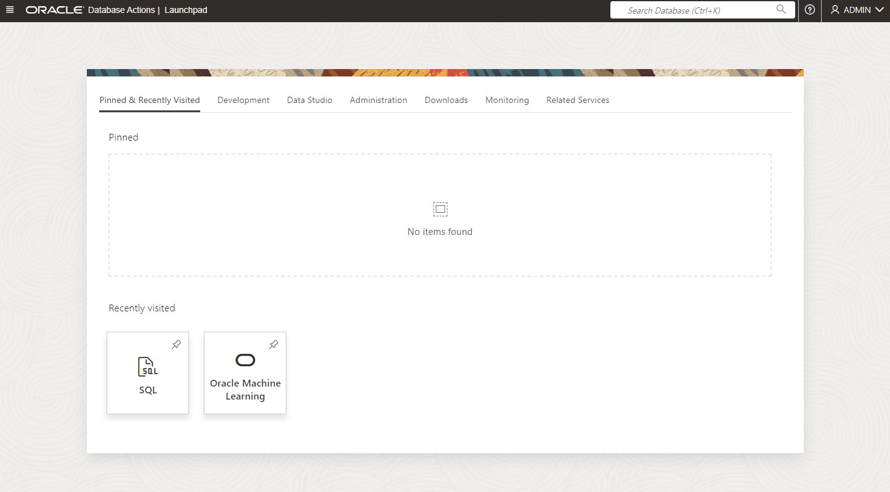


* Click on **Oracle Machine Learning**.
  

  Alternatively you can click on the menu on the top left side on the page and click on the **Oracle Machine Learning** menu.
  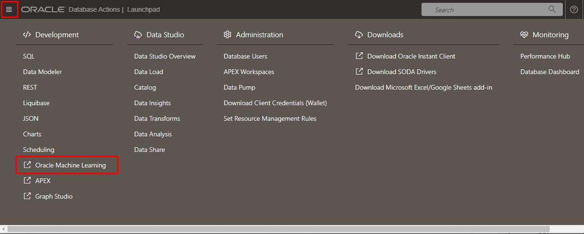


* Login to OML Machine Learning User Interface in Autonomous Database

  Access the Oracle Machine Learning Notebooks link and connect with the credentials that we created earlier. In our case, the credentials are:
    - Username: **OMLUSER**
    - Password: **Welcome12345**

   

* Open a Scratchpad

  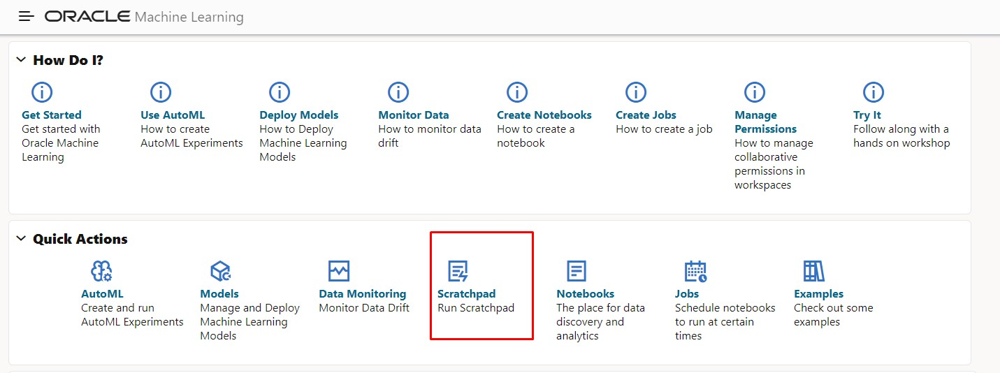


* The notebook server is starting. Once opened, we can run a select on the ``CUSTOMER_INSURANCE`` table
    ```
    <copy> select * from customer_insurance;  </copy>
    ```

    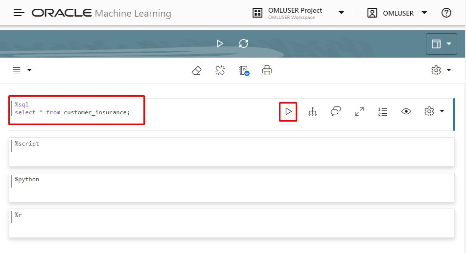

 Notice the columns ``LTV`` and ``LTV_BIN`` when you scroll to the right. These are our targets for the machine learning process.


  * Create the training table. For our AutoML UI a training table is not mandatory because it has the train/test split in the process. Also we will exclude columns later in the process. Considering this demo environment we are still spliting the data in train and test.

     ```
     <copy>
     %script
     create table Customer_insurance_train_classification as
     select CUST_ID,"LAST","FIRST","STATE","REGION","SEX","PROFESSION","BUY_INSURANCE","AGE","HAS_CHILDREN","SALARY","N_OF_DEPENDENTS","CAR_OWNERSHIP","HOUSE_OWNERSHIP","TIME_AS_CUSTOMER","MARITAL_STATUS","CREDIT_BALANCE","BANK_FUNDS","CHECKING_AMOUNT","MONEY_MONTLY_OVERDRAWN","T_AMOUNT_AUTOM_PAYMENTS","MONTHLY_CHECKS_WRITTEN","MORTGAGE_AMOUNT","N_TRANS_ATM","N_MORTGAGES","N_TRANS_TELLER","CREDIT_CARD_LIMITS","N_TRANS_KIOSK","N_TRANS_WEB_BANK", "LTV","LTV_BIN"
     from customer_insurance
     SAMPLE (70) SEED (1)
     where cust_id not in ('CU12350','CU12331', 'CU12286')
     </copy>
     ```
     

     Notice that we keep the ``LTV_BIN`` column. It will be the target for our supervised learning classification model.
      In this workshop, we exclude three specific customers, and we will score three different models using their data.


 * Create the test table for our Auto ML UI

     ```
     <copy>%script
     create table Customer_insurance_test_classification as
     select CUST_ID,"LAST","FIRST","STATE","REGION","SEX","PROFESSION","BUY_INSURANCE","AGE","HAS_CHILDREN","SALARY","N_OF_DEPENDENTS","CAR_OWNERSHIP","HOUSE_OWNERSHIP","TIME_AS_CUSTOMER","MARITAL_STATUS","CREDIT_BALANCE","BANK_FUNDS","CHECKING_AMOUNT","MONEY_MONTLY_OVERDRAWN","T_AMOUNT_AUTOM_PAYMENTS","MONTHLY_CHECKS_WRITTEN","MORTGAGE_AMOUNT","N_TRANS_ATM","N_MORTGAGES","N_TRANS_TELLER","CREDIT_CARD_LIMITS","N_TRANS_KIOSK","N_TRANS_WEB_BANK","LTV","LTV_BIN"
     from customer_insurance
     minus
     select CUST_ID,"LAST","FIRST","STATE","REGION","SEX","PROFESSION","BUY_INSURANCE","AGE","HAS_CHILDREN","SALARY","N_OF_DEPENDENTS","CAR_OWNERSHIP","HOUSE_OWNERSHIP","TIME_AS_CUSTOMER","MARITAL_STATUS","CREDIT_BALANCE","BANK_FUNDS","CHECKING_AMOUNT","MONEY_MONTLY_OVERDRAWN","T_AMOUNT_AUTOM_PAYMENTS","MONTHLY_CHECKS_WRITTEN","MORTGAGE_AMOUNT","N_TRANS_ATM","N_MORTGAGES","N_TRANS_TELLER","CREDIT_CARD_LIMITS","N_TRANS_KIOSK","N_TRANS_WEB_BANK","LTV","LTV_BIN"
      from Customer_insurance_train_classification
     </copy>
     ```
     

     In the testing table, we should not use any of the leading ``LTV`` or ``LTV_BIN`` columns. These columns might be misleading in the testing process. In this specific case we still use them in our verification process.

## Task 2: Use OML AutoML UI from Oracle Autonomous Database


* Go to the Main menu on the top left side near the Oracle Machine Learning icon.


* Click **AutoML Experiments**.
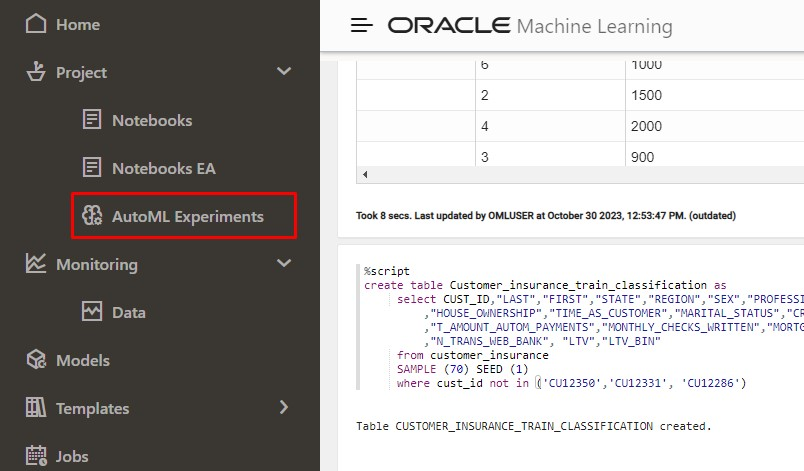


* Click Create in the AutoML Experiments page


* In the Create Experiment page choose the following details:

    - Name: **AutoML Classification**
    - Data Source: chose the **CUSTOMER\_INSURANCE\_TRAIN\_CLASSIFICATION** table in the OMLUSER schema.
    - Predict: **LTV_BIN**
    - Prediction Type: **CLASSIFICATION**
    - Case ID: **CUST_ID**

    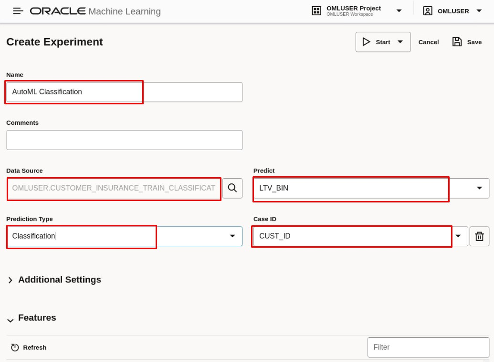

* To make customizations you can expand the Additional Settings menu

    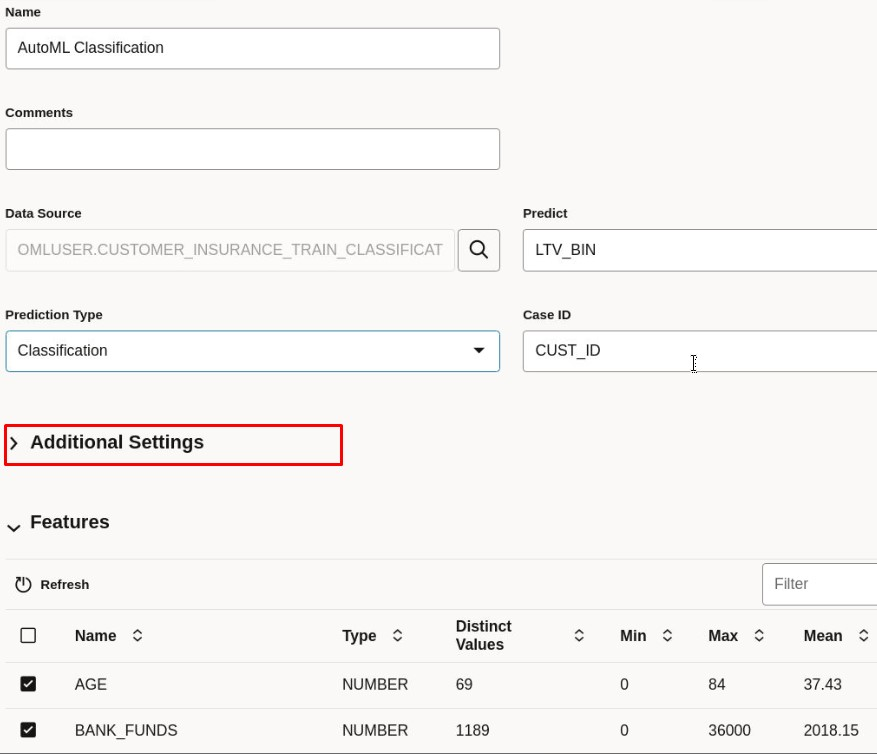

    Notice that we can set the Database Service Level to High and select which metric we should compare the models and which predefined algorithms to include or exclude from this experiment.

      - Choose the following options for your experiment:

        - Database Service Level: **High**
        - Model Metric: **BALANCED ACCURACY**


    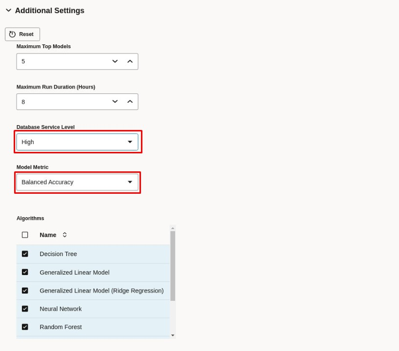


* In the **Features** section, we can deselect the following columns:
    - First
    - Last
    - LTV

  In most cases, the name of the candidate should not be a deciding factor so we will remove them from the model features. Also, the LTV column which is a computational numeric column that drives the LTV_BIN column might be misdirecting the model and this column is removed also.
  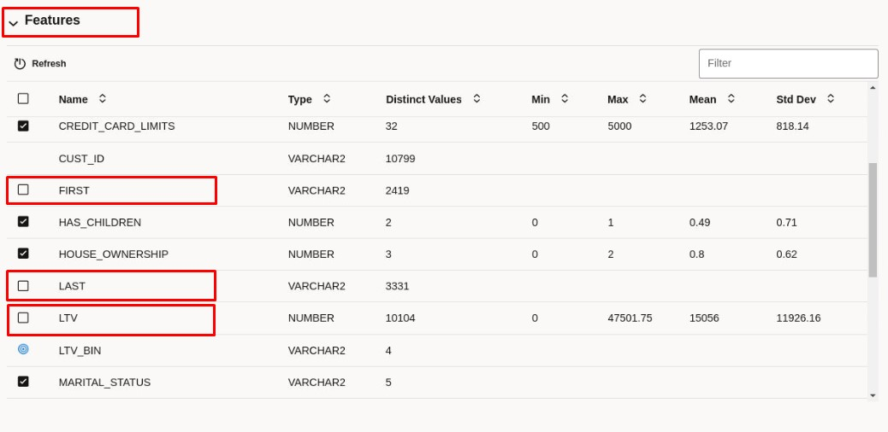

* Run OML Auto ML experiment by clicking **```Start```** and **```Better Accuracy```**.
  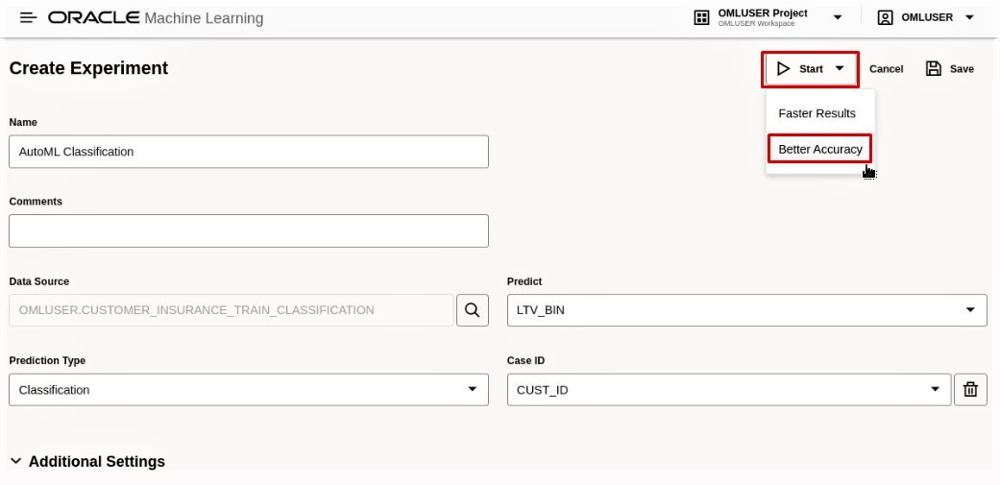

  The AutoML Classification will run for several minutes showing which top 5 algorithms have a Better Accuracy. The running process takes around 20 minutes.

* When completed, we have the result of the experiment
  

  Each model described here is based on one of the selected algorithms. Select the **Support Vector Machine (Gaussian)** algorithm and click on the model name which starts with **SVMG_**.

  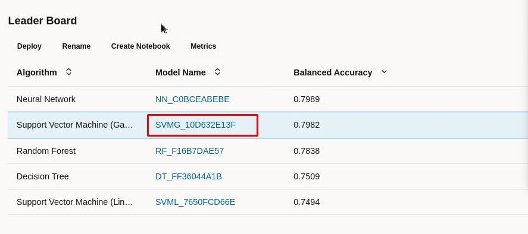

  The model detail window opens and the first tab is Prediction Impacts.

  

  Notice how the other predictor columns impact our model differently and which columns have a higher weight. We can click on the Confusion Matrix tab.

  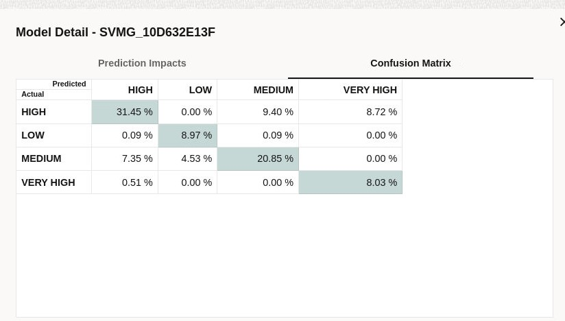

  There we can see for each class: **LOW**, **MEDIUM**, **HIGH**, **VERY HIGH** what percentage of customers correctly predicted for each combination of actual and predicted values.


* We can rename the Support Vector Machine model so it would be easier to recognize in the next sections. For this, we can select the model and click on the Rename button.

  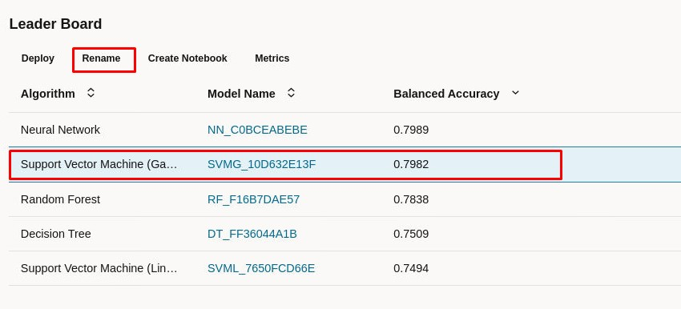

* Enter a new Model Name and click OK. In our case, we are going to use **SVMG** and click OK

  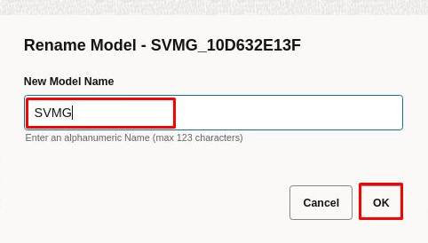

* The model is now renamed in the Leader Board.

  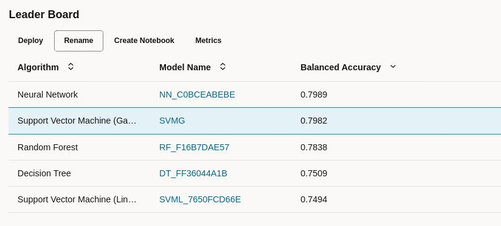

* The next steps are to deploy the model for OML Services for access via Rest endpoints. Click on the Deploy button.

  

  Enter the following details.


    - Name: is prefilled with the Model name.
    - URI: choose a specific URI, for example: **classsvmg**
    - Version: **1**
    - Namespace: **OML**


  Copy the Model URI in an accessible place because we are going to use it in the next sections of the workshop.
  

  Click OK.

  We have confirmation that the model was deployed successfully.
  

## Task 3: Verify the model deployment.

* Go to the Main menu on the top left side near the Oracle Machine Learning icon.
  

* Choose Models.
  

* We see the list of models created by the AutoML UI with their specific algorithm and target value.
  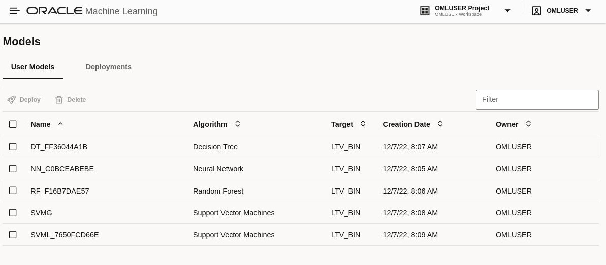


* In the Deployment tab you can see the model and URI

  

  We can now use REST APIs to query the model, model scoring, and scoring for specific data.


## Task 4: Score data against the model using SQL

* Return to the OML Notebooks Scratchpad we created earlier. Click on the menu and chose Notebooks.
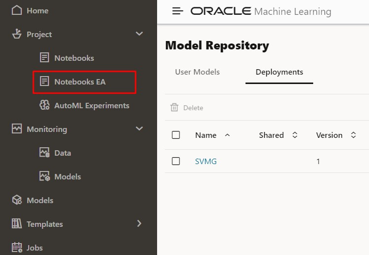


* Click on the Scratchpad notebook.
  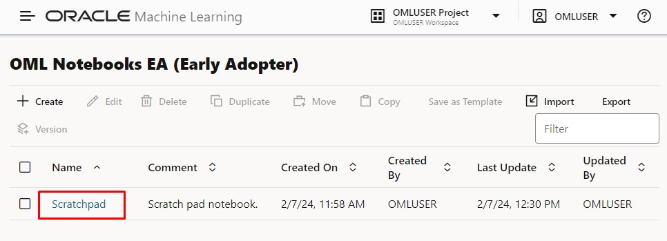


* Run the following SQL statement using the ``CUST_IDs`` we picked in the train test split. You can replace the model name with the one used previously.

   ```
   <copy>%sql
       SELECT a.cust_id,
             a. Last,
             a.First,
             PREDICTION(SVMG USING a.*) PREDICTION,
             PREDICTION_PROBABILITY(SVMG USING a.*)  PREDICTION_PROBABILITY,
             b.LTV_BIN
       FROM Customer_insurance_test_classification a,
       Customer_insurance b
      where a.cust_id = b.cust_id
      and b.cust_id in ('CU12350','CU12331', 'CU12286')
   </copy>
   ```

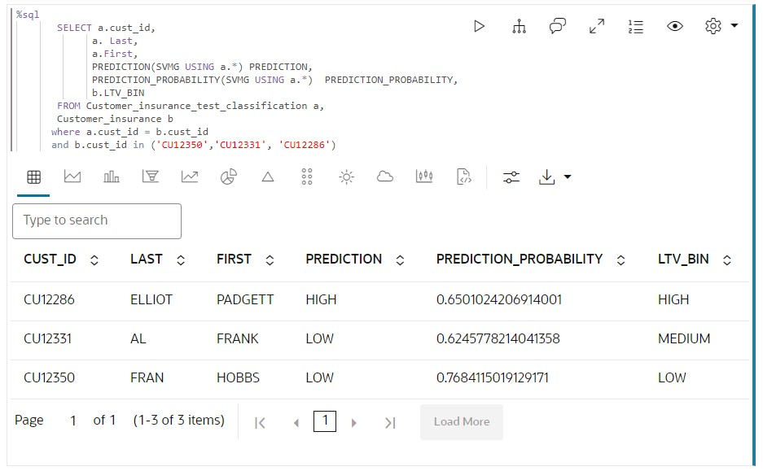

The SQL statement returns the most probable group or class for the data provided in the column PREDICTION with its corresponding prediction probability for each of the customers selected. In our case, the prediction is the same as the actual ``LTB_BIN`` column in the ``CUSTOMER_INSURANCE`` initial table.

* Run the following SQL statement to compare the model predicted value with the actual value in the testing table.

  ```
  <copy>%sql
        SELECT a.cust_id,
               a.Last,
               a.First,
               PREDICTION(SVMG USING a.*) PREDICTION,
               b.LTV_BIN
        FROM Customer_insurance_test_classification a,
        Customer_insurance b
         where a.cust_id = b.cust_id and a.last = b.last
  </copy>
  ```

  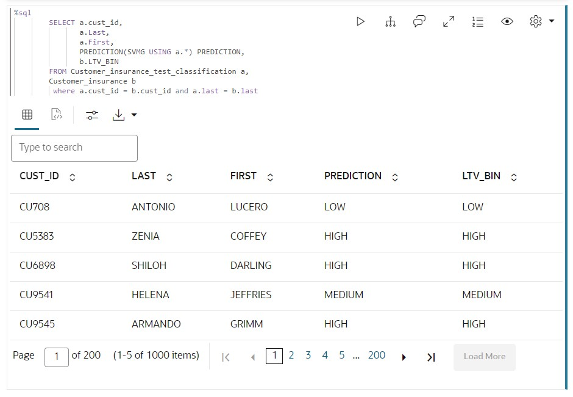

The SQL statement returns the most probable group or class for the data provided in the column ``PREDICTION`` compared with the column ``LTV_BIN`` from the initial table.

You may now [proceed to the next lab](#next).

## Acknowledgements
* **Authors** -  Andrei Manoliu, Milton Wan
* **Contributors** - Rajeev Rumale
* **Last Updated By/Date** -  Andrei Manoliu, December 2021
